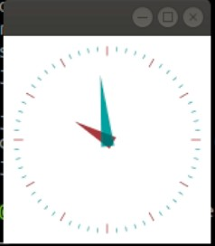
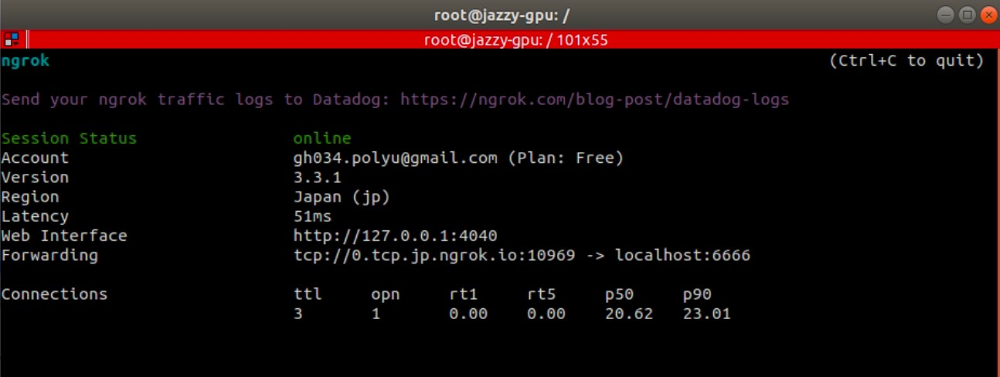

# Docker Practice of AIRO Lab
<p align="justify">With the increasing number of lab members, we are now enforcing a new practice of Docker on publich computing devives, i.e., for all members that wish to use lab machines (including GPU server, UAV/UGV onboard computers, or even UUV in the future), will be required to use Docker container to run their code. The following are the reasons:</p>

- repeating setups for environs are no more needed.
- clashes between libraries could be prevented.
- it's cool.

<p align="justify">
It might be painful at first, but for the <b>COLLECTIVE GOOD AND NEAT PRACTICE</b>, we hope that everyone could cooperate. We have setup a docker container (not constructed with a systematical way yet it work), you can just simply do <b>docker pull {image}</b> and start to do a lotta shit (run ROS and stuff basically). 

Below will first briefly elucidate what we have done to this poor image, and how to <b>ssh, network sharing and visualize files</b>; some ros packages are also included so feel free to try. This repo is in the public domain, people outside our lab are welcomed to use. Similar to many other repo of ours, we love pull requests, so please do offer suggestions!
</p>

## Prerequisite
Refer to this [site](https://docs.docker.com/engine/install/ubuntu/), you can install Docker Engine by following the setup bash command. In Ubuntu, we do not really need Docker Desktop. As we are not considerate people, we will not repeat the installation process here.

First do 

```
./build_lala.sh
```
This will build the docker image. Then, to create one container, do
```
./run_lala.sh
```
After entering the docker container, input
```
echo -e "0000\n0000" | passwd root
```
to set the root passcode.
You can refer to [Dockerfile.lala](/Dockerfile.lala) to see what building arguments we put there.
If you want a more detailed description, please refer to [this](/README_legacy.md).


## What you should test.
### You need to do something now!
1. **Check container status**
   
   Check whether the container is up by
   ```
   docker container ps -a
   ```
   There should be a container listed as:

   

2. **Check visualization** 
   
   Run ```xclock``` and see whether there is a tiny little clock appears like this:
    
    .

   The time might not be right, but it is not really important at this stage.
3. **Check hardware connection** 
   
   In the docker run file, we have specified ```-v/dev:/dev```, which gives basically all USB, video and so on... access to container. 
   
    The easiest way to confirm the connection is to run ```rqt_image_view``` to check the message.

    You can also try to do ```ls /dev/tty``` to check whether the ttl serial is connected.
   
 
4.  **Check external connection** 
   
    First download telnet, it allows you to check the connection with a specified port. 

    Do the following to check ```IP_ADDRESS```.
    ```
    ifconfig
    ```
    

    Then, **outside** your container, do
    ```
    sudo apt install telnet
    telnet {IP_ADDRESS} 6666
    ```
    You should get something like below which shows:
    ```
    Trying {IP_ADDRESS}
    Connected to {IP_ADDRESS}
    ```

    
    Within the image, LHS shows container, whilst RHS shows telnet connection status.

5. So far so good? Now, on any laptop within the same local network, try to do:
    ```
    ssh root@{IP_ADDRESS} -p 6666
    # passcode 0000
    ```

    You should be able to access the container by now. Now, you own a tiny OS within your OS, isn't it interesting?

6. On VScode, access the files inside the container just as an usual ssh server. If you are from AIRO-lab, we strongly you to go through this tutorial [here](https://github.com/HKPolyU-UAV/useful_tools/blob/main/vscode_github/vscode_github.md).
7. As mentioned above, if you want to use ngrok to remote ssh from anywhere, please do the following:
   
   - If you do not have a ngrok account, please register one.
   - After getting one, please do ```ngrok config add-authtoken <your_token>```
   - At the entering file location, do ```./ngrok```.
   - Check the forwarding line , and get the port number; on another random machine (within/out LAN), do 
  
      ```ssh root@0.tcp.ap.ngrok.io -p {port_number} ```

      
   - Also try it in vscode, and see whether you are able to visualize all the code.
   - Voila! With all these, you should be able to code anywhere and anytime.


## Side Note
1. Basically, you should be able to use it as a normal ubuntu ROS environment, just within a sandbox. Again, the main reason for us to use this is that it allows us to setup enviroment on a new machine with only one commandline: i.e., ```docker image pull pattylo/airo_ros_noetic:lala```.
2. Basically image is like a template of a container. Bear this in mind.
3. As you will be launching a lot of terminals within a container, it will be stupid to do ```docker exec``` all the time, and thus, ```tmux``` is recommended. Some very preliminary notes are mentioned [here](https://github.com/HKPolyU-UAV/useful_tools/blob/main/tmux/tmux.md).
4. Some useful docker commandline for your reference:
    ```
    docker image pull {image_name} # pull an image
    docker run -blah_blah {image_name} # run an image and create a container
    docker container ps -a # list all container
    docker image ls # list all image
    
    docker start {container_name} # start container
    docker attach {container_name} # attach to a container, namely, get inside the container
    docker exec -it {container_name} /bin/bash # attach to the same container without echoing the same commandline
    exit # exit container

    docker commit {container_name} {new_image_name} 
    # create an image after you modify a container
    # this could become your new template

    docker rm {container_name}
    docker rmi {image_name}

    docker tag {container_name} {username}/{remote_image_name}
    docker push {username}/{remote_image_name}
    # basically allow you to publish your image
    ```
5. The learning curve of Docker is not steep. We are not very experienced, but were able to pick it up within a week. Just try to search more learning material lah! Have fun Dockering!

## Shoutout
We would like to give a shoutout to the [Larics Lab](https://github.com/larics) for inspiring us to adopt this practice. Go follow them! They are doing some solid engineering work there!

## Maintainer
[pattylo](https://github.com/pattylo) @ AIRO-LAB @ RCUAS, HKPolyU
