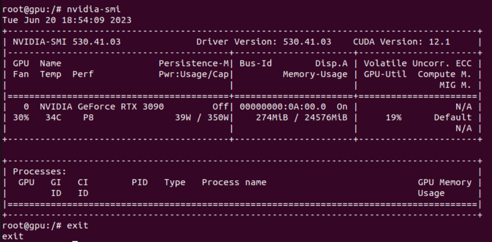
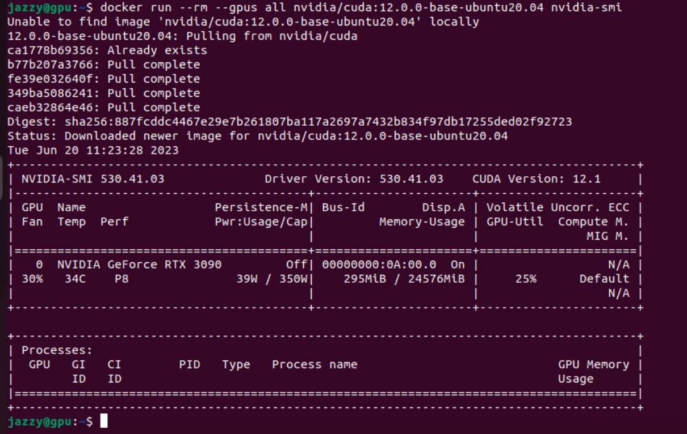

# Docker Practice of AIRO Lab - GPU
The GPU-equipped machine sitting at GH034 prohibits **ANYONE** to install anything. It is for the better good, trust us. 

```
./lalagpu.sh # on GH034 GPU
```

Voila! You may now configure [ngrok](https://github.com/HKPolyU-UAV/useful_tools/blob/main/remote/Remote.md), and access the machine anywhere and have fun with GPU.


## Just For Your Reference
The following is just a brief description of what I have done to this our machine and this poor image. Note that our environment is Ubuntu 22.04 (x86_64) w/ RTX3090 GPU.

1. **Prerequisite (Host)**
   
   Confirm Nvidia driver.

   ```
   nvidia-smi
   ```
   and make sure the following was retreived:

   

   Then,

   ```
   git clone https://github.com/NVIDIA/cuda-samples.git
   cd cuda-samples/Samples/1_Utilities/deviceQuery
   make
   ./deviceQuery
   ```
   and make sure the following was retreived:

   


2. **Install Nvidia-Docker-related Shit (Host)**
   
   Make sure docker is installed
   ```
   docker --version
   ```

   Then, 
   ```
   curl -fsSL https://nvidia.github.io/libnvidia-container/gpgkey | sudo gpg --dearmor -o /usr/share/keyrings/nvidia-container-toolkit-keyring.gpg
   sudo nano /etc/apt/sources.list.d/nvidia-container-toolkit.list
    # paste deb [signed-by=/usr/share/keyrings/nvidia-container-toolkit-keyring.gpg] https://nvidia.github.io/libnvidia-container/stable/ubuntu22.04/$(ARCH) /
   sudo apt update
   sudo apt install nvidia-docker2
   sudo reboot
   ```

3. **Confirm GPU Accessibility**
   
   ```
   docker run --rm --gpus all nvidia/cuda:12.0.0-base-ubuntu20.04 nvidia-smi
   ```

   And got something like this:

   

   Run a test docker image.

   ```
   docker run -it --gpus all nvidia/cuda:12.1.0-devel-ubuntu20.04 
   ```
   
   Actually, we ran [lala_nvidia.sh](/lala_nvidia.sh) so that we could share the internet and hardware access of the host. Note that the only difference with [lala.sh](/lala.sh) is that there is a ```--gpus all``` argument.


4. **Setup Container and Test Environment (Container)**
   
   Inside the run-image, we did the followings:
   
   ```
   apt install update
   apt install upgrade
   cd /home
   git clone https://github.com/NVIDIA/cuda-samples.git
   cd cuda-samples/Samples/1_Utilities/deviceQuery
   make
   ./deviceQuery
   ```
   
   And got the same result as in host.

5. **Install Some Irrelevant Shit (Container)**
   
   ```
   # sudo apt install nano gedit curl tmux ros
   ```

6. **Install cudnn (Container)**
   
   Went here to download zip file: https://developer.nvidia.com/rdp/cudnn-download. We here downloaded *cuDNN v8.8.1 (March 8th, 2023), for CUDA 12.x*  Then,

   ```
   docker cp cudnn-linux-x86_64-8.8.1.3_cuda12-archive {container_ID}:/home/Downloads/cudnn-linux-x86_64-8.8.1.3_cuda12-archive
   ```

   Then move them around

   ```
   sudo cp {whatever_it_is_called}/include/cudnn*.h /usr/local/cuda/include
   sudo cp -P {whatever_it_is_called}/lib64/libcudnn* /usr/local/cuda/lib64
   sudo chmod a+r /usr/local/cuda/include/cudnn*.h /usr/local/cuda/lib64/libcudnn*

   sudo cp -P {whatever_it_is_called}/include/cudnn.h /usr/include
   sudo cp -P {whatever_it_is_called}/lib64/libcudnn* /usr/lib/x86_64-linux-gnu/
   sudo chmod a+r /usr/lib/x86_64-linux-gnu/libcudnn*

   ```
   Check cuDNN path
   ```
   whereis cudnn
   ```

7. **Install OpenCV**
   
   Install some dependencies and libraries first.
   
   ```
   sudo apt-get update
   sudo apt-get upgrade

   sudo apt install cmake pkg-config unzip yasm git checkinstall libjpeg-dev libpng-dev libtiff-dev libavcodec-dev libavformat-dev libswscale-dev libavresample-dev libgstreamer1.0-dev libgstreamer-plugins-base1.0-dev libxvidcore-dev x264 libx264-dev libfaac-dev libmp3lame-dev libtheora-dev libfaac-dev libmp3lame-dev libvorbis-dev libopencore-amrnb-dev libopencore-amrwb-dev

   sudo apt-get install libdc1394-22 libdc1394-22-dev libxine2-dev libv4l-dev v4l-utils

   cd /usr/include/linux
   sudo ln -s -f ../libv4l1-videodev.h videodev.h
   
   sudo apt-get install libgtk-3-dev libtbb-dev libatlas-base-dev gfortran

   ```

   For ```CUDA 12.1``` and ```cudnn 8.1.1``` (again, on RTX3090), we installed OpenCV 4.7.0, since some folks (兄弟) online say that this serves a more stable compilation (and empirically speaking, **IT IS**... we have tried A LOT of versions and finally get it down).

   ```
   wget -O opencv.zip https://github.com/opencv/opencv/archive/refs/tags/4.7.0.zip
   wget -O opencv_contrib.zip https://github.com/opencv/opencv_contrib/archive/refs/tags/4.7.0.zip
   unzip opencv.zip
   unzip opencv_contrib.zip
   ```

   Below is the standard process of compiling OpenCV from source with cmake-gui. And of course, you can use cmake-gui if you like.

   ```
   # in opencv-x.x.x
   mkdir build
   cd build
   ```
   and do

   ```
   cmake -D CMAKE_BUILD_TYPE=RELEASE \
    -D CMAKE_INSTALL_PREFIX=/usr/local \
    -D WITH_TBB=ON \
    -D ENABLE_FAST_MATH=1 \
    -D CUDA_FAST_MATH=1 \
    -D WITH_CUBLAS=1 \
    -D WITH_CUDA=ON \
    -D BUILD_opencv_cudacodec=OFF \
    -D WITH_CUDNN=ON \
    -D OPENCV_DNN_CUDA=ON \
    -D CUDA_ARCH_BIN=8.6 \
    -D WITH_V4L=ON \
    -D WITH_QT=OFF \
    -D WITH_OPENGL=ON \
    -D WITH_GSTREAMER=ON \
    -D OPENCV_GENERATE_PKGCONFIG=ON \
    -D OPENCV_PC_FILE_NAME=opencv.pc \
    -D OPENCV_ENABLE_NONFREE=ON \
    -D PYTHON_EXECUTABLE=$(which python3) \ 
    -D OPENCV_PYTHON3_INSTALL_PATH=$(python3 -c "from distutils.sysconfig import get_python_lib; print(get_python_lib())") \
    -D PYTHON3_INCLUDE_DIR=$(python3 -c "from distutils.sysconfig import get_python_inc;  print(get_python_inc())") \ 
    -D PYTHON3_PACKAGES_PATH=$(python3 -c "from distutils.sysconfig import get_python_lib; print(get_python_lib())") \
    -D OPENCV_EXTRA_MODULES_PATH=/home/Downloads/opencv_contrib-4.7.0/modules \
    -D INSTALL_PYTHON_EXAMPLES=OFF \
    -D INSTALL_C_EXAMPLES=OFF \
    -D BUILD_EXAMPLES=OFF ..
   ```

   and do
   
   ```
   nproc
   make -j{no_of_cores}
   sudo make install
   ```

   and do
   ```
    sudo /bin/bash -c 'echo "/usr/local/lib" >> /etc/ld.so.conf.d/opencv.conf'
    sudo ldconfig
   ```


   
8. 
   
   Then we install cudnn.

9.  df
